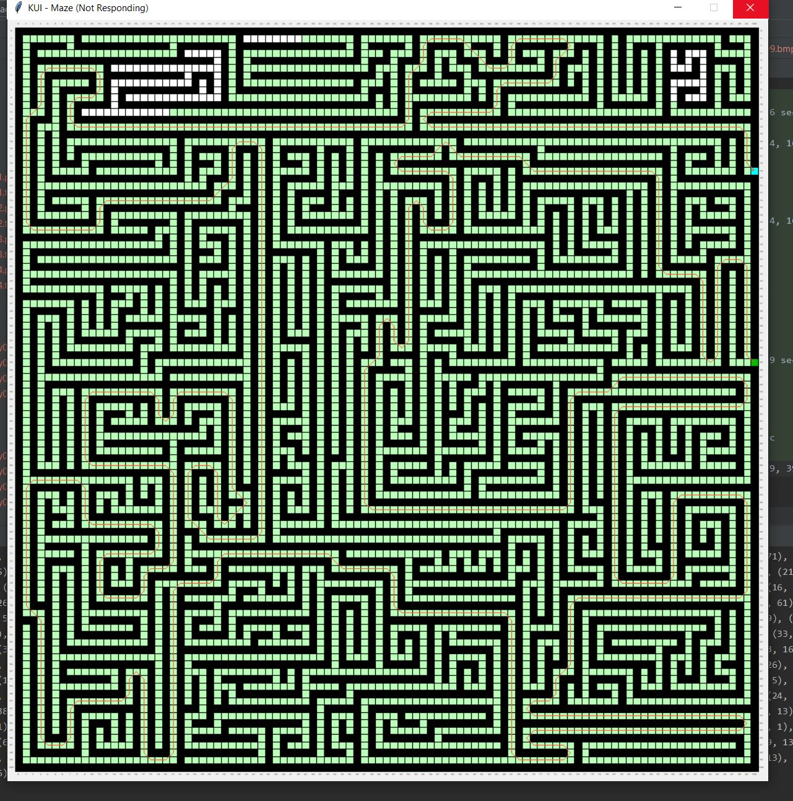

[Install Open AI gym](https://stackoverflow.com/questions/58224472/how-to-conda-install-openai-gym-on-linux-package-conflicts) 

* switch to conda env used for running
* `conda install -c hcc -c conda-forge python=3.8 gym`

Run tests
 2nd integer argument enables GUI and specifies time for which the solution is shown
 
 ```shell script
python agent.py maps_difficult/maze50x50_empty03.png
maps_difficult/maze50x50_empty03.png : path len 93, takes 0.21545350000000002 sec
path
[(100, 45), (99, 44), (99, 43), (99, 42), (99, 41), (99, 40), (99, 39), (99, 38) ...
```

Time comparison with and without GUI ~ 55x (normal)... ~290 (difficult)

```shell script
python agent.py maps/normal/normal11.bmp
maps/normal/normal11.bmp : path len 26, takes 0.07389209999999996 sec
path
[(3, 9), (4, 10), (4, 11), (4, 12), (4, 13), (4, 14), (4, 15), (4, 16), (4, 17),

maps/normal/normal11.bmp : path len 26, takes 0.07227329999999998 sec
path
[(3, 9), (4, 10), (4, 11), (4, 12), (4, 13), (4, 14), (4, 15), (4, 16), (4, 17),

python agent.py maps/normal/normal11.bmp 5
maps/normal/normal11.bmp : path len 26, takes 4.1040162 sec
path
[(3, 9), (4, 10), (4, 11), (4, 12), (4, 13), (4, 14), (4, 15), (4, 16), (4, 17),

maps/normal/normal11.bmp : path len 26, takes 4.1856023 sec
path
[(3, 9), (4, 10), (4, 11), (4, 12), (4, 13), (4, 14), (4, 15), (4, 16), (4, 17),

python agent.py maps/normal/normal12.bmp
maps/normal/normal12.bmp : path len 27, takes 0.04336119999999999 sec
path
[(13, 10), (12, 11), (11, 12), (10, 13), (9, 13), (8, 13),

python agent.py maps/normal/normal12.bmp 5
maps/normal/normal12.bmp : path len 27, takes 2.3544407 sec
path
[(13, 10), (12, 11), (11, 12), (10, 13), (9, 13), (8, 13),

python agent.py maps_difficult/maze50x50.png
maps_difficult/maze50x50.png : path len 1013, takes 3.7849461 sec
path
[(100, 45), (99, 44), (99, 43), (99, 42), (99, 41), (99, 40), (99, 39), (99, 38), (99, 37),

python agent.py maps_difficult/maze50x50.png 10
maps_difficult/maze50x50.png : path len 1013, takes 1081.2968205 sec
path
[(100, 45), (99, 44), (99, 43), (99, 42), (99, 41), (99, 40), (99, 39), (99, 38), (99, 37),

python agent.py maps_difficult/maze100x100_empty01.png
maps_difficult/maze100x100_empty01.png : path len 281, takes 449.7809077 sec
path
[(200, 85), (199, 84), (199, 83), (199, 82), (199, 81), (199, 80), (199, 79), (199, 78), (199, 77),
```
 
