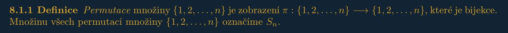

# Prednasky

[Seznam](https://math.fel.cvut.cz/en/people/velebil/teaching/lag_2021_podzim.html)

## 7A: Determinant, část 1.
[Prezentace](http://math.fel.cvut.cz/en/people/velebil/files/lag_2021_podzim/lag_handout07a.pdf)
[Prednaska](https://www.youtube.com/watch?v=M24Mn0qw6fI&list=PLQL6z4JeTTQnNU26jFe4R2889mBcEPWlh&index=24)
Klíčová slova: permutace, strunový diagram, znaménko permutace, determinant matice, geometrický význam determinantu, výpočet determinantu pomocí GEM.
Keywords: permutation, string diagram, sign of a permutation, determinant of a matrix, geometric interpretation of a determinant, computation of a determinant using GEM.
Podrobnosti: AKLA, podkapitola 8.1 a 8.2.



## 8A: Vlastní čísla a vlastní vektory.
[Prezentace](https://math.fel.cvut.cz/en/people/velebil/files/lag_2021_podzim/lag_handout08a.pdf)
Klíčová slova: vlastní číslo (hodnota), vlastní vektor, invariantní prostor, charakteristický polynom matice.
Keywords: eigenvalue, eigenvector, eigenspace, characteristic polynomial of a matrix.
Podrobnosti: AKLA, podkapitoly 10.1, 10.3 a 10.4.

## Math

```math
\int \sin^{2}{\left(x \right)}\, dx = \frac{x}{2} - \frac{\sin{\left(x \right)} \cos{\left(x \right)}}{2}
```